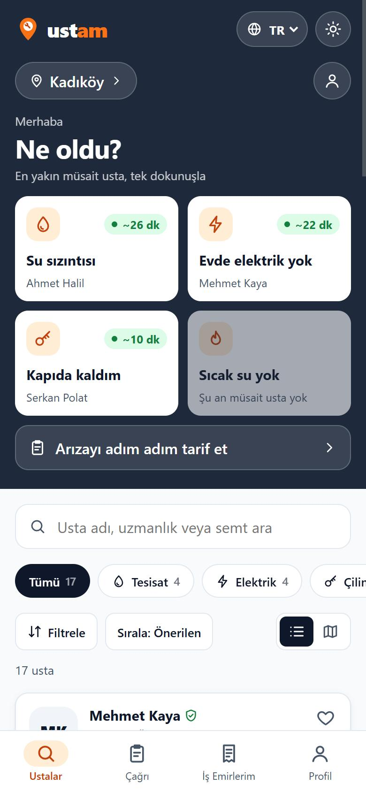

# 11 — Veri Sözleşmesi: Tipler ve Örnek Veri

Görev: [`docs/tasks/week-4/11-veri-sozlesmesi.task.md`](../tasks/week-4/11-veri-sozlesmesi.task.md) · Dal: `feature/11-veri-sozlesmesi`

## Şartname

**Amaç:** Usta, Hizmet ve İş emri başta olmak üzere bütün veri tipleri tek klasörde, alan açıklamalı ve sabit seçenek listeli olsun; örnek veri tek dosyada ve her tipten en az 6 kayıt içersin; tip hataları `bun run check` ile derlemede yakalansın.

**Kapsam dışı:** Ekranların görünümü ve davranışı değişmez. İş kuralları (kod formatı, fiyat) değişmez. Bileşenlerin kendi `Props` arayüzleri bileşende kalır.

**Kabul ölçütleri:**
- [x] `src/lib/types/` altında her tip ayrı dosyada (`ortak`, `usta`, `hizmet`, `isEmri`, `kural`, `profil`, `liste`, `bildirim`) ve `index.ts`.
- [x] Her alanın yanında tek satır açıklama; isteğe bağlı alanlar `?` ve "İsteğe bağlı" notuyla ayrılmış.
- [x] Durum alanları sabit seçenek listesi: `IS_DURUMLARI`, `IS_ASAMALARI`, `ACILIYETLER`, `ODEME_TERCIHLERI`, `IPTAL_NEDENLERI`, `KATEGORILER`, `ROZETLER`, `DILLER`, `SEMTLER`, `KOD_DURUMLARI`, `TEMA_TERCIHLERI`, `SIRALAMALAR`, `GORUNUMLER`, `NEDEN_TURLERI`, `BILDIRIM_TURLERI`.
- [x] Örnek veri tek dosyada (`src/lib/data.ts`): 17 usta, 15 hizmet, 6 iş emri, 35 yorum.
- [x] Store ve kural dosyalarındaki tip tanımları taşındı; `any` yok.
- [x] `bun run check` (`astro check`) 0 hata; `docs/veri-modeli.md` ve AGENTS kuralı.

**Dokunulacak dosyalar:** `src/lib/types/*` (yeni), `src/types/ustam.ts` (silindi), `src/lib/data.ts`, tip tanımlayan store/kural dosyaları (`kurallar`, `profil`, `bildirim`, `eslestirme`, `takip`, `tema`, `arama`, `yorumlar`, `isEmirleri`), `src/components/Ustalar.svelte`, 26 dosyada içe aktarma yolu, `tests/data.test.ts`, `package.json`, `tsconfig.json`, `.github/workflows/ci.yml`, `docs/veri-modeli.md` (yeni), `docs/proje-fikri.md`, `docs/klasor-mimarisi.md`, `docs/kurallar.md`, `AGENTS.md`.

**Doğrulama adımları:** `bun run check`, `bunx svelte-check`, `bun run build`, `bun run test`; ana ekranın görev öncesiyle aynı göründüğünü kontrol; `any` araması.

## Araç ve model

Claude Code (Claude masaüstü uygulaması) · **Claude Opus 5.5** (`claude-opus-5-5`).

## İstem

```text
Uygulamamın veri sözleşmesini tek yerde toplamak istiyorum. Uygulama: Ustam — acil arızada yakındaki müsait ustayı 4 dilde bulup çağıran, her çağrıya Rust ile iş emri kodu üreten Tauri uygulaması.
Ana veri tiplerim: Usta, Hizmet, İş emri. Eksik gördüğün tipi öner.
1. Mevcut kodu tara: bileşenlerde, store'larda ve veri dosyalarında tanımlı ya da ima edilen tipleri listele.
2. `src/lib/types/` altında her tip için ayrı dosya ve bir `index.ts` oluştur. Her alana tek satır açıklama yaz. Durum alanlarını sabit seçenek listesi yap.
3. Dağınık tip tanımlarını buraya taşı, içe aktarmaları güncelle. Hiçbir yerde `any` bırakma.
4. Örnek veriyi tek dosyada topla; her tipten en az 6 gerçekçi kayıt olsun.
5. `package.json`'a `check` betiği ekle (`astro check`) ve hataları sıfırla.
6. `docs/veri-modeli.md` yaz ve `AGENTS.md` indeksine ekle. Ayrıca `AGENTS.md`'ye şu kuralı ekle: yeni veri alanı önce `src/lib/types/` içinde tanımlanır.
Son olarak: `bun run build` 0 hata vermeli. Bitince hangi dosyaları neden değiştirdiğini madde madde özetle ve benim elle denemem gereken adımları yaz.
```

## Plan

Önce denetim istemiyle mevcut durum çıkarıldı:

| Madde | Durum | Kanıt |
|---|---|---|
| `src/lib/types/` klasörü, ≥3 tip ayrı dosyada | **eksik** | tipler tek dosyada: `src/types/ustam.ts` |
| Alan açıklamaları, sabit seçenekler | **kısmen** | birkaç alanda yorum vardı; durumlar `"aktif" \| …` birleşim tipi, liste değil |
| Örnek veri tek dosyada, her tipten ≥6 | **kısmen** | `src/lib/data.ts`: 17 usta var; hizmet bilgisi iki ayrı tabloda (`kategoriSorunlari`, `sorunBilgisi`); örnek iş emri yok |
| Dağınık tipler taşınmış, `any` yok | **kısmen** | `any` yok; ama `kurallar.ts`, `profil`, `bildirim`, `eslestirme`, `takip`, `tema`, `arama`, `yorumlar`, `isEmirleri` ve `Ustalar.svelte` kendi tiplerini tanımlıyor |
| `bun run check` | **eksik** | betik ve `@astrojs/check` yok |
| `docs/veri-modeli.md` + AGENTS kuralı | **eksik** | — |

Plan:
1. `src/lib/types/` — `ortak.ts` (Dil, Semt, Yaka, Konum), `usta.ts` (Usta, Yorum, Kategori, Rozet, UstaDurumu, YorumKaydi), `hizmet.ts` (**Hizmet** — öneri: sorun + işçilik + süre + tehlike tek tipte), `isEmri.ts` (CagriTaslagi, IsEmri, Aciliyet, IsDurumu, IsAsamasi, OdemeTercihi, IptalNedeni, EskiIsEmriKaydi, TakipBilgisi), `kural.ts` (Rust karşılıkları), `profil.ts`, `liste.ts`, `bildirim.ts`, `index.ts`. Seçenekler `as const` dizi, tip diziden türetilir.
2. 26 dosyada `types/ustam` yolunu yeni klasöre çevir; dağınık tanımları sil, içe aktar.
3. `data.ts`: `hizmetler: Hizmet[]` tek kaynak; `sorunBilgisi` ve `kategoriSorunlari` ondan türesin. Kodu ve fiyatı gerçek kurallarla üretilen 6 örnek iş emri (`ornekIsEmirleri`).
4. `tests/data.test.ts`: her tipten ≥6 kayıt, sabit listelerle uyum, örnek iş emirlerinin kodu/fiyatı/usta–sorun tutarlılığı.
5. `@astrojs/check` + `check` betiği; CI'ya adım.
6. `docs/veri-modeli.md` (alan tabloları + ilişki şeması); `proje-fikri.md` içindeki kopya tabloyu bağlantıyla değiştir (DRY); `klasor-mimarisi.md`, AGENTS indeksi ve kırmızı çizgi.

## Düzeltmeler

- **`tsconfig.json` kapsamı:** Android derlemesinden sonra `src-tauri/target/` içinde sıkıştırılmış `.js` dosyaları oluşmuştu; tip denetimi bunları okuyup 120 sahte hata verdi. `src-tauri` tsconfig `exclude` listesine eklendi.
- **`baseUrl` uyarısı:** TypeScript 6'da kullanımdan kalkan `baseUrl` kaldırıldı, `paths` göreli yazıldı (`./src/lib/*`); svelte-check uyarısı 1 → 0.
- **Eksik içe aktarmalar:** Taşımadan sonra `isEmirleri.svelte.ts` (`CagriTaslagi`) ve `yorumlar.svelte.ts` (`Yorum`) içinde iki tip eksik kaldı; svelte-check yakaladı, eklendi.
- **Tekrarlanan tablo:** `docs/proje-fikri.md` içindeki tip tablosu `docs/veri-modeli.md` ile çakışacaktı; AGENTS'taki "doküman tekrar edilmez" kuralı gereği bağlantıyla değiştirildi.
- **Kullanılmayan içe aktarma:** `astro check` ipucu verdi (`CanliRozet.tsx` içinde `React`); kaldırıldı.

## Doğrulama

```text
$ bun run check
Result (47 files):
- 0 errors
- 0 warnings

$ bunx svelte-check --tsconfig ./tsconfig.json --threshold error
COMPLETED 781 FILES 0 ERRORS 0 WARNINGS 0 FILES_WITH_PROBLEMS

$ bun run test
 93 pass
 0 fail

$ bun run build
[build] Complete!
```

- "Projede `any` geçen yer kaldı mı?" → `src`, `tests`, `araclar` içinde arama: **0 sonuç**.
- `docs/veri-modeli.md` tablosu tip dosyalarıyla tek tek karşılaştırıldı; yorum sayısı ilk yazımda 36'ydı, betikle sayılınca 35 olarak düzeltildi.
- Ana ekran görev öncesiyle aynı (390×844, gündüz teması, saat 23:16 — kombi ustaları mesai dışında olduğu için "Sıcak su yok" kutusu soluk):


