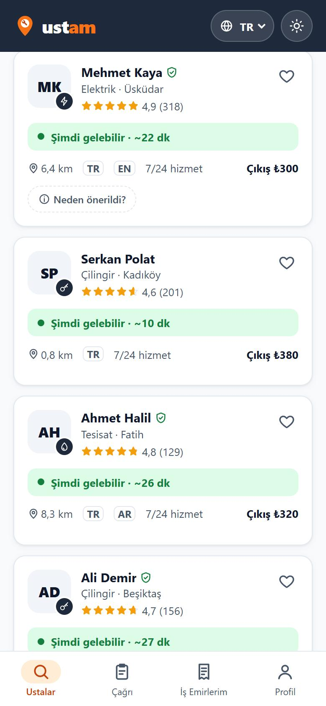
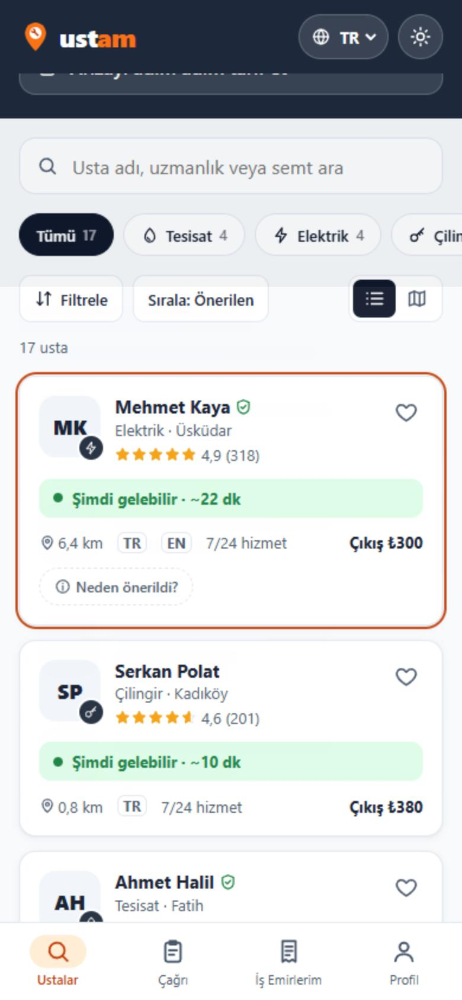
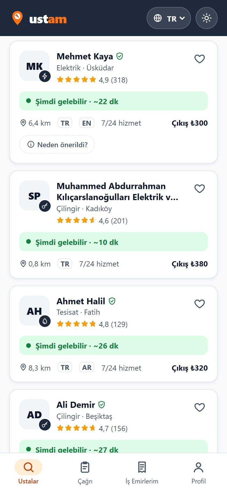
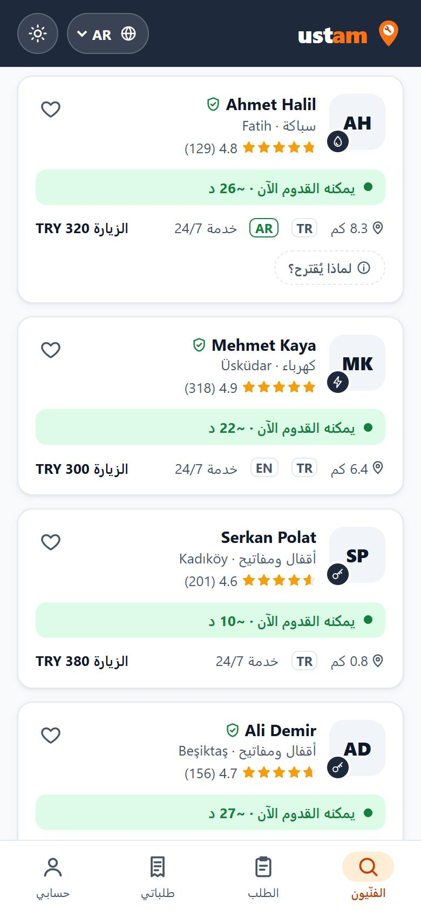

# 12 — Kart Bileşeni

Görev: [`docs/tasks/week-4/12-kart-bileseni.task.md`](../tasks/week-4/12-kart-bileseni.task.md) · Dal: `feature/12-kart-bileseni`

## Şartname

**Amaç:** Listelerde tek, veri tipinden bağımsız bir kart kullanılsın; ana ekrandaki usta listesi bu kartla kurulsun ve kart görselsiz, uzun başlıklı ve sağdan sola düzende bozulmasın.

**Kapsam dışı:** Ustanın detay ekranı, harita görünümü ve "Ne oldu?" kısayol kutuları değişmez. Sıralama ve süzgeç kuralları değişmez.

**Kabul ölçütleri:**
- [x] `src/lib/components/ui/Kart.svelte` — girdiler: `baslik`, `altMetin?`, `gorsel?`, `etiket?`, `etiketTuru?` (`bilgi` · `basari` · `uyari` · `hata`), `href?` ya da `onclick`.
- [x] Girdi tipi `src/lib/types/ui.ts` içinde (`KartGirdisi`); kart `Usta` ya da başka veri tipini içe aktarmıyor.
- [x] Renk, boşluk ve köşe değerleri `app.css` değişkenlerinden; eksik üç değişken önce `app.css` ve `branding.md`'ye eklendi.
- [x] Görselsiz, uzun başlıklı ve AR/FA düzeninde düzgün; Tab ile odaklanır, Enter ile açılır; görselin alternatif metni var.
- [x] Ana ekranda 17 usta bu kartla; eski `UstaKart.svelte` silindi.

**Dokunulacak dosyalar:** `src/lib/components/ui/Kart.svelte` (yeni), `src/lib/types/ui.ts` (yeni), `src/lib/types/liste.ts` (`UstaKartBaglami`), `src/lib/ustaKarti.ts` (yeni, dönüşüm), `src/components/Ustalar.svelte`, `src/lib/components/UstaKart.svelte` (silindi), `src/styles/app.css`, `docs/branding.md`, `tests/ustaKarti.test.ts` (yeni), eski kart adını anan iki belge.

**Doğrulama adımları:** ana ekranda kart sayısı; Tab + Enter; dili AR yapıp ekran görüntüsü; uzun başlık; `Kart.svelte` içinde hex ve veri tipi araması; `bun run build`.

## Araç ve model

Claude Code (Claude masaüstü uygulaması) · **Claude Opus 5.5** (`claude-opus-5-5`).

## İstem

```text
Uygulamamda listelerde kullanacağım tek bir kart bileşeni istiyorum.
1. `src/lib/components/ui/Kart.svelte` oluştur. Girdiler: baslik, altMetin?, gorsel?, etiket?, etiketTuru? ('bilgi' | 'basari' | 'uyari' | 'hata'), href? ya da tıklama olayı. Girdi tipini `src/lib/types/ui.ts` içinde tanımla.
2. Bileşen benim veri tiplerimi içe aktarmasın; dönüşümü kartı kullanan ekran yapsın.
3. Bütün renk, boşluk ve köşe değerleri `src/styles/app.css` değişkenlerinden gelsin. Eksik değişken varsa önce oraya ekle.
4. Görselsiz, çok uzun başlıklı ve sağdan sola düzende düzgün görünsün. Klavyeyle odaklanıp Enter ile açılabilsin.
5. Ustalar (ana sayfa) ekranındaki mevcut listeyi bu kartla yeniden kur; ekrana özel eski kart kodunu sil.
Son olarak: `bun run build` 0 hata vermeli. Bitince hangi dosyaları neden değiştirdiğini madde madde özetle ve benim elle denemem gereken adımları yaz.
```

## Plan

Denetim sonucu: genel kart **yok** (`UstaKart.svelte` doğrudan `Usta` alıyor, favori/yorum store'larını kendisi okuyor); klavye ve RTL **kısmen** (bağlantı katmanı vardı); `ui/` klasörü **yok**.

1. `types/ui.ts`: `KartGirdisi` (istenen girdiler + kartın usta kartındaki bilgiyi taşıyabilmesi için genel, isteğe bağlı `puan`, `bilgiler[]`, `deger`, `soluk`), `KartGorseli` (`alt` zorunlu; `src` ya da `harfler`; köşe ikonu), `KartBilgisi`, `EtiketTuru` sabit listesi.
2. `ui/Kart.svelte`: başlık `href` varsa `<a>`, yoksa `onclick` ile `<button>`; `::after` katmanı kartın tamamını tıklanabilir yapar. Ekranın ekleyeceği parçalar için üç yuva: `baslikEki`, `eylem` (sağ üst), `children` (alt). Etiket türleri `--basari*`, `--vurgu*`, `--hata*`, `--yuzey-2` ile.
3. `src/lib/ustaKarti.ts`: `ustaKartGirdisi(usta, baglam)` — saf dönüşüm; bağlam (mesafe, durum, puan özeti, çevirmen) ekrandan gelir. Böylece kart store'ları da tanımaz.
4. `Ustalar.svelte`: `UstaKart` yerine `<Kart {...ustaKartGirdisi(...)}>`; favori düğmesi `eylem`, doğrulanmış ikonu `baslikEki`, "Neden önerildi?" `children` yuvasında. `UstaKart.svelte` silinir.
5. Uzun başlık iki satırda `line-clamp`; `overflow-wrap: anywhere`. Mantıksal özellikler (`inline-end`, `text-align: start`).
6. Test: `tests/ustaKarti.test.ts`.

## Düzeltmeler

- **Eksik değişkenler:** Görsel kutusu (52 px), hap köşesi (999 px) ve küçük kutu köşesi (6 px) sabit sayıydı. Görev "değişken yoksa önce `app.css`'e ekle" dediği için `--kart-gorsel`, `--radius-hap`, `--radius-mini` eklendi ve `branding.md` tablosuna yazıldı. İlk sürümde kalan `3px`, `5px`, `2px` boşluklar da `--b-*` değişkenlerine çevrildi.
- **Boş alt alan:** "Neden önerildi?" yalnız ilk kartta gösterildiği hâlde diğer kartlarda boş bir alt alan boşluk bırakıyordu (Svelte `children`'ı her kartta veriyor). `.ek-icerik:empty { display: none }` ile giderildi.
- **Tip yeri:** Dönüşüm bağlamı (`UstaKartBaglami`) ilk önce `ustaKarti.ts` içinde tanımlanmıştı; Görev 11 kuralına uyması için `src/lib/types/liste.ts`'e taşındı.
- **Klavye denemesi:** JavaScript ile `focus()` çağrıldığında odak çerçevesi görünmedi (tarayıcı bunu klavye odağı saymıyor); deneme gerçek Tab tuşuyla tekrarlandı ve çerçeve göründü.

## Doğrulama

```text
$ bun run build      → Complete!
$ bun run check      → 0 errors
$ bun run test       → 97 pass, 0 fail (4 yeni kart dönüşümü testi)
$ bunx svelte-check  → 0 ERRORS 0 WARNINGS
```

- Ana ekranda **17** kart (`.genel-kart`), eski kart sınıfı **0**.
- "`Kart.svelte` içinde sabit renk kodu ya da benim veri tiplerime bağımlılık var mı?" → hex/rgb araması **0 sonuç**; tek içe aktarma `KartGirdisi` (`types/ui.ts`).
- Tab ile "Harita" düğmesinden sonra ilk karta odak geçti (`:focus-visible`, turuncu çerçeve); Enter ile `/usta/11` açıldı.
- Dil AR: `dir="rtl"`, görsel sağa, favori sola geçti; yatay taşma yok. Uzun başlık iki satırda "…" ile kırpıldı.

| Ana ekran (17 kart) | Klavye odağı | Uzun başlık | Arapça (RTL) |
|---|---|---|---|
|  |  |  |  |
