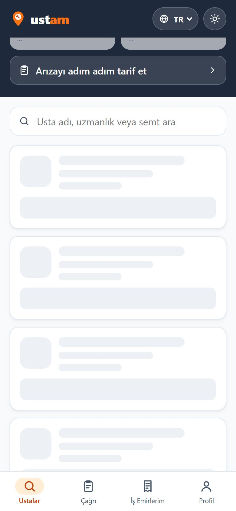
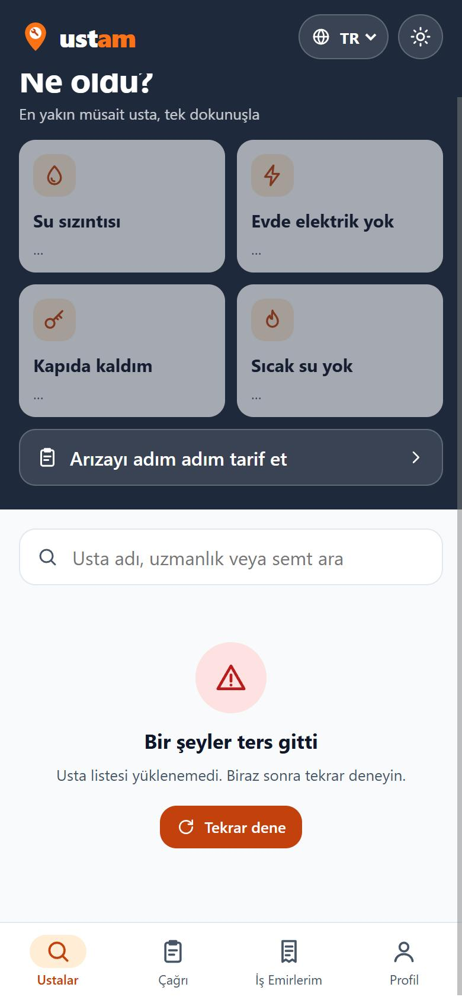
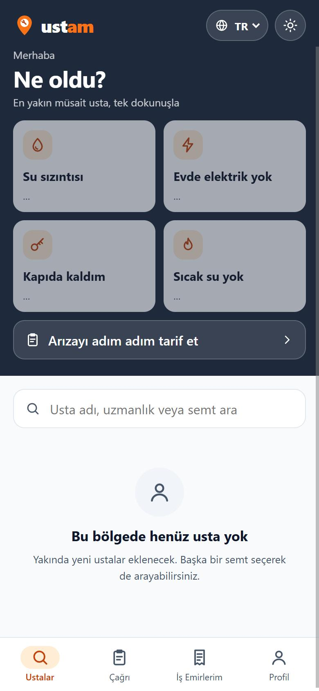
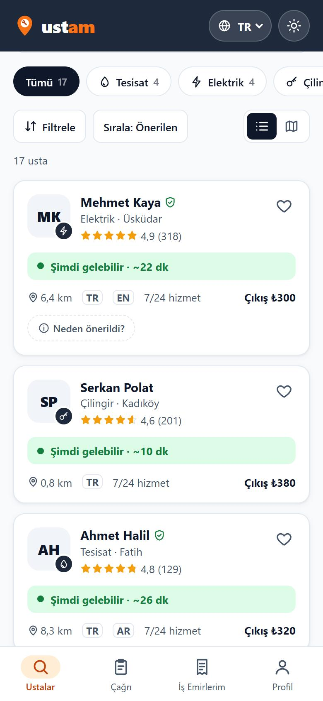
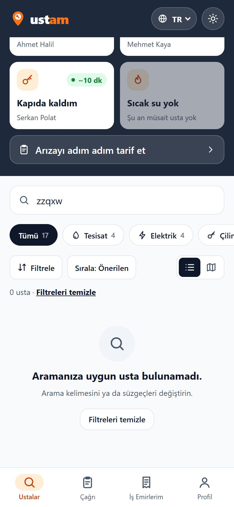
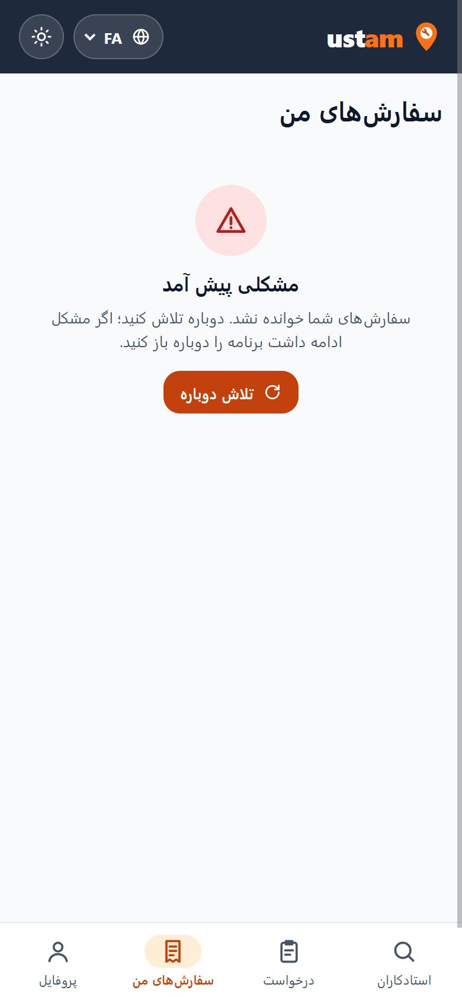
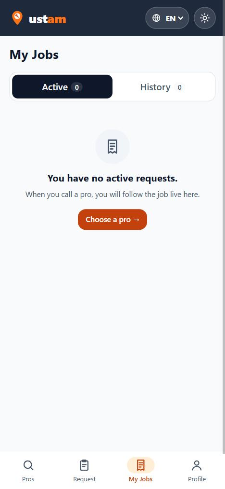

# 13 — Liste Ekranı ve Üç Durum

Görev: [`docs/tasks/week-4/13-liste-ve-uc-durum.task.md`](../tasks/week-4/13-liste-ve-uc-durum.task.md) · Dal: `feature/13-liste-ve-uc-durum`

## Şartname

**Amaç:** Usta listesi ve İş emirlerim, veri hazır değilken de ne olduğunu söyleyen bir ekran göstersin: yükleniyor, hata, boş ya da dolu.

**Kapsam dışı:** Veri kaynağı değişmez (örnek veri, cihazdaki iş emirleri); yapay gecikme ya da sahte ağ isteği eklenmez (AGENTS kırmızı çizgisi). Kart görünümü (Görev 12) değişmez.

**Kabul ölçütleri:**
- [x] `src/lib/components/ui/` altında `Yukleniyor` (iskelet), `BosDurum` (başlık, açıklama, isteğe bağlı düğme), `HataDurumu` (mesaj, "Tekrar dene"); sabit renk yok.
- [x] Ana liste tek yükleme işlevinden (`ustalariYukle`) gelir; ekran dört halden yalnız birini gösterir.
- [x] Arama / süzgeç sonucu boşsa `BosDurum` + "Filtreleri temizle".
- [x] Metinler 4 dilde (`durum.*`, 10 anahtar × 4 dil).
- [x] Aynı üç bileşen İş emirlerim ekranında da; dört hal + iki ekranın ekran görüntüleri bu kayıtta.
- [x] Geliştirme sırasında dört hali açmanın yolu (`?durum=`) `docs/gelistirme-notlari.md` içinde.

**Dokunulacak dosyalar:** `src/lib/components/ui/{Yukleniyor,BosDurum,HataDurumu}.svelte` (yeni), eski `src/lib/components/BosDurum.svelte` (silindi), `src/lib/yukleyici.ts` (yeni), `src/lib/types/{ui,liste}.ts`, `src/components/{Ustalar,IsEmirlerim,Cagri,Profil}.svelte`, `src/lib/ceviriler.ts`, `src/lib/ikonlar.ts` (`yenile`), `tests/yukleyici.test.ts` (yeni), `docs/gelistirme-notlari.md` (yeni), `AGENTS.md`.

**Doğrulama adımları:** dört hali `?durum=` ile açıp ekran görüntüsü; hata halinde "Tekrar dene"; anlamsız arama; dil değiştirme; `bun run build`, `bun run check`, `bun run test`.

## Araç ve model

Claude Code (Claude masaüstü uygulaması) · **Claude Opus 5.5** (`claude-opus-5-5`).

## İstem

```text
Ana liste ekranımda (Ustalar — ana sayfa) veri hazır değilken de düzgün bir şey göstermek istiyorum.
1. `src/lib/components/ui/` altında üç genel bileşen oluştur: Yukleniyor (iskelet), BosDurum (baslik, aciklama, dugmeMetni?, tıklama olayı), HataDurumu (mesaj, tekrar dene olayı). Renkler `app.css` değişkenlerinden.
2. Liste verisini tek bir yükleme işlevinden al. Ekran dört halden yalnız birini göstersin: yükleniyor, hata, boş, dolu.
3. Arama ya da süzgeç sonucu boşsa BosDurum göster ve süzgeci temizleme düğmesi ekle.
4. Metinleri dört dile ekle (TR, EN, AR, FA).
5. Aynı bileşenleri İş Emirlerim ekranına da bağla.
6. Dört hali elle deneyebilmem için geliştirme sırasında kullanacağım basit bir yol öner (örn. adres çubuğuna `?durum=hata` yazmak) ve bunu `docs/gelistirme-notlari.md` içine yaz.
Son olarak: `bun run build` 0 hata vermeli. Bitince hangi dosyaları neden değiştirdiğini madde madde özetle ve benim elle denemem gereken adımları yaz.
```

## Plan

Denetim: `BosDurum` vardı ama `src/lib/components/` altında ve "hata" türünü de taşıyordu (**kısmen**); `Yukleniyor` yalnız Astro iskeleti olarak vardı, Svelte listesinde yoktu (**eksik**); `HataDurumu` **eksik**; liste `data.ts`'ten doğrudan okunuyordu (**eksik**); süzgeç boş hali **vardı**; İş emirlerim kendi `.bos` biçimini kullanıyordu (genel `.bos` sınıfıyla aynı ad — AGENTS kırmızı çizgisi).

1. `types/ui.ts`: `BosDurumGirdisi`, `HataDurumuGirdisi`; `types/liste.ts`: `LISTE_DURUMLARI` / `ListeDurumu`.
2. Üç bileşen `ui/` altında; metinleri ekran verir, bileşen sözlük ve veri tipi tanımaz. `HataDurumu` `role="alert"`, `Yukleniyor` `role="status"` + gizli etiket.
3. `src/lib/yukleyici.ts`: `listeYukle(kaynak)` ve `ustalariYukle()`. Veri hâlâ cihazdaki örnek veri; gecikme eklenmez. `?durum=` yalnız `import.meta.env.DEV` iken okunur.
4. `Ustalar.svelte`: `ustalar` artık yüklenen durum değişkeni; çipler, araç satırı ve liste dört hale göre. "Ne oldu?" kutuları yüklenirken "…" gösterir.
5. `IsEmirlerim.svelte`: aynı yükleyici (`listeYukle(() => isEmirleri.liste)`), sekme boşlukları `BosDurum`; `.bos` CSS'i silinir. Çağrı ve Profil ekranları da yeni `BosDurum`'a geçer, eski bileşen silinir.
6. `ceviriler.ts`: 10 `durum.*` anahtarı × 4 dil. `ikonlar.ts`: `yenile`.
7. `tests/yukleyici.test.ts`, `docs/gelistirme-notlari.md`, AGENTS indeksi.

## Düzeltmeler

- **"Tekrar dene" hep hata veriyordu:** `?durum=hata` adreste kaldığı için tekrar deneme de hata veriyordu; görev "Tekrar dene'ye basın: liste geliyor mu?" diye sınadığı için zorlanan hata bir kez gösterilip adresten silinecek biçimde değiştirildi (geçici arıza gibi).
- **İskelet çok soluktu:** `--yuzey-2` beyaz kartta neredeyse görünmüyordu; kutular `--kenar` rengine alındı.
- **Kısayol kutuları:** boş halde de "…" yazıyordu; yalnız yükleniyor/hata halinde "…", boş halde "Şu an müsait usta yok".
- **Seçili sekme turuncuydu:** İş emirlerim'de aktif sekme `--renk-ana` ile boyanıyordu; AGENTS kuralına göre seçili durum `--secili` olmalı — düzeltildi.

## Doğrulama

```text
$ bun run test       → 102 pass, 0 fail (5 yeni yükleyici testi)
$ bun run check      → 0 errors
$ bunx svelte-check  → 0 ERRORS 0 WARNINGS
$ bun run build      → Complete!
```

- `?durum=yukleniyor` → 4 iskelet kart, `role="status" aria-busy="true"`.
- `?durum=hata` → hata ekranı; **Tekrar dene** → 17 kart geldi, hata kalktı.
- `?durum=bos` → "Bu bölgede henüz usta yok".
- Aramaya `zzqxw` → "Aramanıza uygun usta bulunamadı" + **Filtreleri temizle**; düğmeye basınca arama boşaldı, 17 kart döndü.
- İş emirlerim: FA'da `?durum=hata` (sağdan sola, Farsça metin), tekrar dene sonrası EN'de boş sekme.

| Yükleniyor | Hata | Boş | Dolu |
|---|---|---|---|
|  |  |  |  |

| Arama boş + temizle | İş emirlerim — hata (FA) | İş emirlerim — boş (EN) |
|---|---|---|
|  |  |  |
