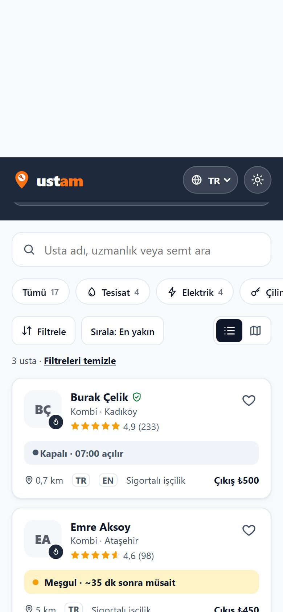
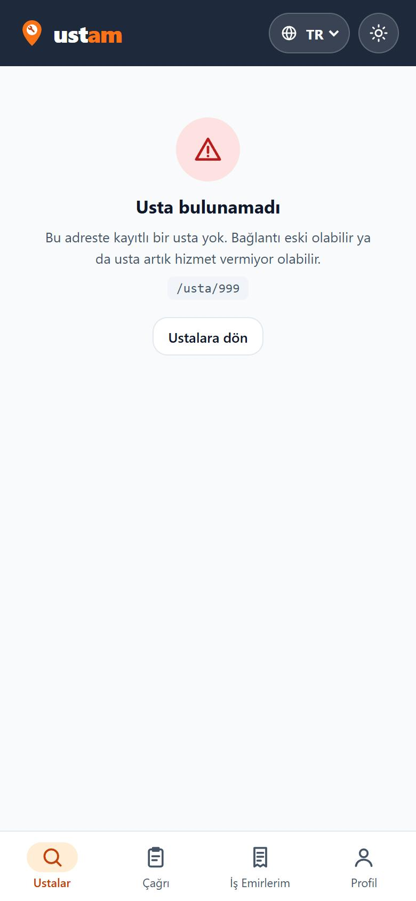
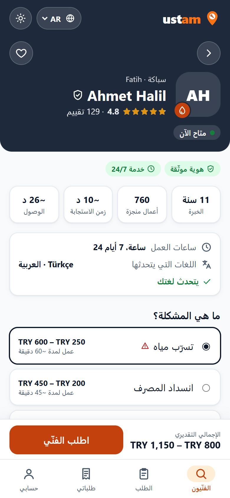

# 14 — Detay Ekranı ve Gezinme

Görev: [`docs/tasks/week-4/14-detay-ekrani.task.md`](../tasks/week-4/14-detay-ekrani.task.md) · Dal: `feature/14-detay-ekrani`

## Şartname

**Amaç:** Karta dokunan kullanıcı ustanın profilini kendi adresinde görsün; geri dönünce listedeki arama ve süzgeç kaybolmasın; olmayan bir kimlikte boş sayfa yerine "bulunamadı" ekranı çıksın.

**Kapsam dışı:** Detay ekranının içeriği (sorun seçimi, aciliyet, fiyat, yorumlar) ve çağrı akışı değişmez.

**Kabul ölçütleri:**
- [x] Kart → `/usta/<id>` (ör. `/usta/3`); doğru usta açılır; adres doğrudan açılabilir.
- [x] Geri (detaydaki düğme ve tarayıcının geri tuşu) listeye döner; kategori, arama, sorun, sıralama ve süzgeç korunur.
- [x] Olmayan kimlik (`/usta/999`) → `HataDurumu` ile "Usta bulunamadı" + "Ustalara dön".
- [x] Detay 4 dilde; AR ve FA'da sağdan sola.
- [x] `docs/mimari-agac.md` sayfa ağacı güncel.

**Dokunulacak dosyalar:** `src/lib/listeAdresi.ts` (yeni), `src/lib/types/{liste,ui}.ts`, `src/components/Ustalar.svelte`, `src/components/UstaDetay.svelte`, `src/components/Bulunamadi.svelte` (yeni), `src/pages/404.astro` (yeni), `src/lib/components/ui/HataDurumu.svelte` (dönüş bağlantısı), `src/lib/ceviriler.ts`, `tests/listeAdresi.test.ts` (yeni), `docs/mimari-agac.md`.

**Doğrulama adımları:** üç farklı karta tıklama; `/usta/999`; süzgeç seç → detay → geri; detay adresini yeni pencerede açma; AR'de detay.

## Araç ve model

Claude Code (Claude masaüstü uygulaması) · **Claude Opus 5.5** (`claude-opus-5-5`).

## İstem

```text
Usta için detay ekranı istiyorum.
1. Karta tıklayınca `/usta/[id]` adresinde detay ekranı açılsın. Mevcut dil rotası düzenine uy.
2. Detayda şunlar görünsün: ad, kategori ve semt, puan ve yorum sayısı, anlık durum, rozetler, deneyim / tamamlanan iş / yanıt süresi / uzaklık, çalışma saatleri, konuştuğu diller, sorunlar ve fiyat aralıkları, yorumlar.
3. Geri düğmesi listeye dönsün; listedeki arama ve süzgeç seçimi kaybolmasın.
4. Olmayan bir kimlikle açılırsa Görev 13'teki HataDurumu bileşeniyle "bulunamadı" göster.
5. `docs/mimari-agac.md` içindeki sayfa ağacını güncelle.
Son olarak: `bun run build` 0 hata vermeli. Bitince hangi dosyaları neden değiştirdiğini madde madde özetle ve benim elle denemem gereken adımları yaz.
```

## Plan

Denetim:

| Madde | Durum | Kanıt |
|---|---|---|
| Kimlikli adres, doğru öğe | karşılanıyor | `src/pages/usta/[id].astro` (`getStaticPaths`, 17 sayfa); kart `href="/usta/<id>"` |
| Geri dönüşte arama/süzgeç korunur | **eksik** | geri düğmesi `href="/"`; süzgeç yalnız bileşen durumunda, sayfa değişince sıfırlanıyor |
| Olmayan kimlik | **eksik** | `/usta/999` için sayfa üretilmiyor; özel 404 yok (Astro'nun varsayılan sayfası) |
| 4 dil + RTL | karşılanıyor | `UstaDetay.svelte` `dil.t(...)`, Layout `dir` |
| Mimari ağaç | **kısmen** | detay var; bulunamadı ve adres parametreleri yok |

1. `src/lib/listeAdresi.ts`: `secimOku(adres)` / `secimYaz(seçim)` — saf işlevler; varsayılanlar adrese yazılmaz, tanınmayan değerler varsayılana düşer, başka anahtarlara (`?durum=`) dokunulmaz.
2. `Ustalar.svelte`: durum adresten başlar; seçim değişince `history.replaceState` (yeni geçmiş kaydı açmadan) ve son liste adresi oturumda saklanır.
3. `UstaDetay.svelte`: geri düğmesi son liste adresine; doğrudan açıldıysa `/`.
4. `404.astro` + `Bulunamadi.svelte`: `HataDurumu` ile; `/usta/…` adresinde "Usta bulunamadı", diğerlerinde "Sayfa bulunamadı"; `HataDurumu`'na isteğe bağlı dönüş bağlantısı (`donusMetni`, `donusHref`). 5 yeni metin × 4 dil.
5. `tests/listeAdresi.test.ts`, `docs/mimari-agac.md`.

## Düzeltmeler

- **Açık yönlendirme:** Oturumdan okunan son liste adresi yalnız `/` ile başlıyor diye kabul ediliyordu; `//başka-site` biçimi de `/` ile başladığı için ayrıca reddedildi.
- **Sorun ve kategori çelişkisi:** Adreste hem `sorun` hem `kat` varsa kategori sorundan alınır (`?sorun=sicak-su-yok&kat=tesisat` → kombi); yazarken de yalnız `sorun` yazılır. Testle sabitlendi.
- **Tarayıcıda deneme:** Geçişler (ClientRouter) sırasında alınan bazı ekran görüntüleri iki sayfayı üst üste gösterdi; durumlar ayrıca JavaScript ile (adres, seçili çip, sıralama, kart listesi) doğrulandı.

## Doğrulama

```text
$ bun run test   → 107 pass, 0 fail (5 yeni adres testi)
$ bun run check  → 0 errors
$ bun run build  → 38 page(s) built · Complete!  (yeni: dist/404.html)
```

- Üç kart: Mehmet Kaya → `/usta/2`, Serkan Polat → `/usta/11`, Ahmet Halil → `/usta/9`; her adres 200 döndü ve başlığı doğru ustanın adı.
- Kombi çipi + "En yakın" → adres `/?kat=kombi&sirala=yakin`; Emre Aksoy'un detayına girildi; geri düğmesinin adresi `/?kat=kombi&sirala=yakin`; dönüşte seçili çip "Kombi 3", sıralama "En yakın", 3 kart. Tarayıcının geri tuşuyla da aynı sonuç.
- `/usta/999` → "Usta bulunamadı", istenen adres ve "Ustalara dön" (son liste adresine).
- `/usta/4` doğrudan (yeni sekme gibi) açıldı → aynı ekran.
- AR: detay `dir="rtl"`, yatay taşma yok.

| Geri dönüşte süzgeç | Bulunamadı | Detay (AR) |
|---|---|---|
|  |  |  |

> İlk görüntünün üstündeki boş şerit, önizleme panelinin sayfa geçişi sırasında çizim kaymasıdır; uygulamada yoktur.
