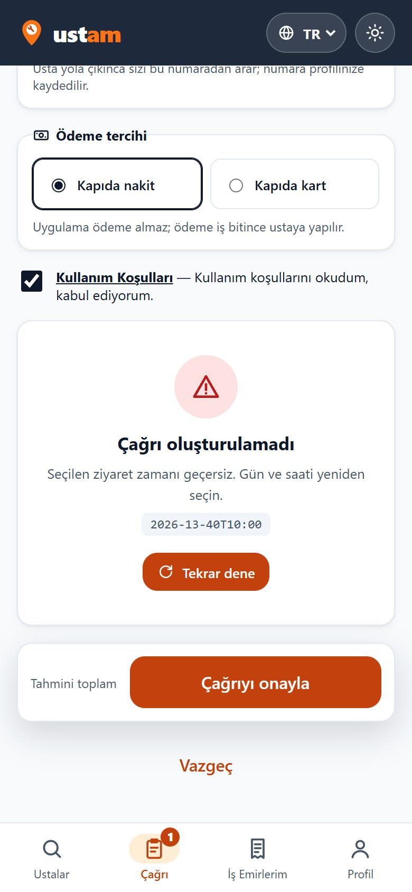
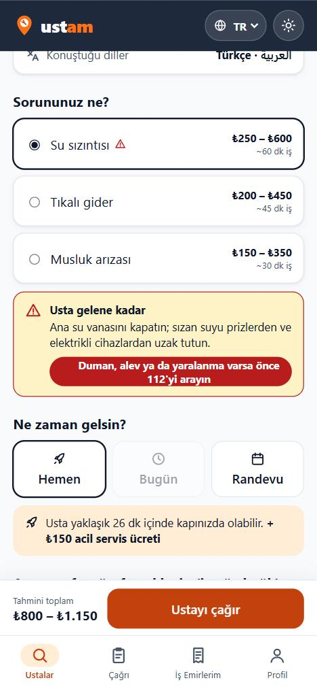

# 15 — Rust Komutu: Tipli Sonuç ve Hata

Görev: [`docs/tasks/week-4/15-rust-komutu.task.md`](../tasks/week-4/15-rust-komutu.task.md) · Dal: `feature/15-rust-komutu`

## Şartname

**Amaç:** Rust komutları başarıda alanları belli bir yapı, başarısızlıkta türü belli bir hata döndürsün; arayüz Rust'a tek dosyadan gitsin; tarayıcıda ekran çökmesin; uygulama beş platformda platformun yoluyla çalışsın, desteklenmeyen özellik o platformda hiç görünmesin.

**Kapsam dışı:** İş kurallarının sonuçları (kod biçimi, fiyat oranları) değişmez — yalnız hata yolları tipli olur. Yeni Tauri eklentisi eklenmez (opener zaten vardı).

**Kabul ölçütleri:**
- [x] Projeye özgü komutlar: `is_emri_uret`, `is_emri_dogrula`, `fiyat_hesapla` + yeni `veri_dosyasi_kaydet`; şablondan kalan örnek komut (`greet`) yok.
- [x] Başarıda `struct` (`UretilenKod`, `FiyatDokumu`, `KaydedilenDosya`), başarısızlıkta `enum KomutHatasi`; düz `String` hata yok; geçersiz girdide panik yok.
- [x] Rust çağrılarının hepsi `src/lib/native.ts` üzerinden; bileşenlerde `invoke` / `@tauri-apps` yok.
- [x] Tarayıcıda `native.ts` TS kurallarıyla aynı sonucu ve aynı tipli hatayı verir.
- [x] Sonuç ve hata tipleri `src/lib/types/native.ts` (+ `kural.ts`) — Rust alanlarıyla aynı.
- [x] Hata arayüzde `HataDurumu` ile (çağrı onayı).
- [x] Rust'ta 13 test (5 yeni); `cargo test` geçiyor.
- [x] Platform kuralı: `docs/platform-destegi.md` tablosu; `native.ts` `platform()` + `destekleniyorMu()`; 112 düğmesi masaüstünde gizli; veri dışa aktarma masaüstünde Rust ile dosya (`#[cfg(desktop)]`), mobilde pano (`#[cfg(mobile)]`).
- [x] `docs/komutlar.md` ve AGENTS indeksi + "yeni özellikte tablo güncellenir" kuralı.

**Dokunulacak dosyalar:** `src-tauri/src/lib.rs`, `src-tauri/test-vektorleri.json`, `src/lib/native.ts` (yeni; `motor.ts` silindi), `src/lib/types/native.ts` (yeni), `src/lib/kurallar.ts`, `src/lib/veri.ts`, `src/lib/isEmirleri.svelte.ts`, `src/lib/cagri.svelte.ts`, `src/components/{Cagri,IsKarti,UstaDetay,Profil}.svelte`, `src/lib/ceviriler.ts`, `tests/{kurallar,native}.test.ts`, `docs/{komutlar,platform-destegi}.md` (yeni), `docs/{mimari-agac,klasor-mimarisi}.md`, `AGENTS.md`.

**Doğrulama adımları:** `cargo test`; `bun run test`; tarayıcıda geçersiz girdiyle çağrı onayı; tarayıcıda 112 düğmesi; `native.ts` dışında Tauri çağrısı araması; Android için derleme.

## Araç ve model

Claude Code (Claude masaüstü uygulaması) · **Claude Opus 5.5** (`claude-opus-5-5`).

## İstem

```text
Uygulamamın Rust tarafında şu işi yapan bir komut istiyorum: iş emri kodu üretimi ve hizmet türü, aciliyet ve zamana göre fiyat dökümü (mevcut komutları tipli hale getir).
1. Komut başarıda alanları belli bir yapı (struct), başarısızlıkta türleri belli bir hata (enum) döndürsün. Düz String döndürme. Geçersiz girdide panik yapma, hata döndür.
2. Şablondan kalan örnek komutu kaldır ya da bu komuta dönüştür.
3. Arayüz tarafında `src/lib/native.ts` oluştur (varsa genişlet): Rust çağrılarının hepsi yalnız bu dosyadan geçsin. Bileşenlerdeki doğrudan çağrıları buraya taşı.
4. Uygulama tarayıcıda çalışıyorsa `native.ts` çökmesin: makul bir yedek sonuç ya da "yalnız uygulamada" hatası dönsün.
5. Sonuç ve hata tiplerini `src/lib/types/` altına, Rust yapısıyla aynı alanlarla yaz.
6. Hatayı arayüzde HataDurumu bileşeniyle göster.
7. Rust tarafına en az 2 test yaz (bir başarılı, bir hatalı girdi) ve `cargo test` çalıştır.
8. Komutu, girdilerini, çıktısını ve hata türlerini `docs/komutlar.md` içine yaz; `AGENTS.md` indeksine ekle.
9. Platform kuralı: uygulamam Android, iOS, macOS, Windows ve Linux'ta çalışmalı. Uygulamadaki her özelliği (bu komut dahil) beş platform için değerlendir: destekleniyor / farklı yolla destekleniyor / desteklenmiyor. Farklı yolla desteklenenleri o platformun yoluyla yap (Rust tarafında `#[cfg(target_os = ...)]` ya da `cfg!(mobile)`, uygun Tauri eklentisi). Hiç desteklenmeyenleri o platformda arayüzden tamamen kaldır; devre dışı düğme ya da hata mesajı bırakma.
10. `native.ts` içine `platform()` ve `destekleniyorMu(ozellik)` ekle; bileşenler platform adını kendileri sorgulamasın. Sonucu `docs/platform-destegi.md` içine özellik × platform tablosu olarak yaz ve `AGENTS.md`'ye şu kuralı ekle: yeni özellik eklenirken bu tablo güncellenir.
Son olarak: `bun run build` 0 hata vermeli. Bitince hangi dosyaları neden değiştirdiğini madde madde özetle ve benim elle denemem gereken adımları yaz.
```

## Plan

Denetim:

| Madde | Durum | Kanıt |
|---|---|---|
| Projeye özgü komut, şablon komutu yok | karşılanıyor | `lib.rs`: `is_emri_uret`, `is_emri_dogrula`, `fiyat_hesapla`; `greet` yok |
| Tipli sonuç ve tipli hata | **kısmen** | `fiyat_hesapla` struct döndürüyor ama hata `String`; `is_emri_uret` `Result<String, String>`; eksi tutar `u32` serde hatasına (düz metin) düşüyordu |
| Tek giriş noktası `native.ts` | **kısmen** | köprü vardı ama adı `motor.ts`; `IsKarti` panoya doğrudan yazıyor, `UstaDetay` `tel:` bağlantısını doğrudan kullanıyordu |
| Tarayıcı yedeği | karşılanıyor | `motor.ts` → `kurallar.ts` |
| Tipler `types/` içinde | **kısmen** | `FiyatDokumu` var; sonuç/hata tipleri yok |
| Hata `HataDurumu` ile | **eksik** | çağrıda düz metin hata kutusu (`String(e)`) |
| ≥2 Rust testi | karşılanıyor | 8 test; hata türü testi yok |
| Platform tablosu, `platform()`, `destekleniyorMu()` | **eksik** | — |

1. **Rust:** `enum KomutHatasi` (`#[serde(tag = "tur", content = "ayrinti")]`), `struct UretilenKod`; `fiyat_hesapla` tutarları `i64` alıp sırayla denetler (tarih → aciliyet → tutarlar → aralık); `is_emri_uret` sistem saati hatasında da panik yapmaz.
2. **Platforma göre farklı komut:** `veri_dosyasi_kaydet` — `#[cfg(desktop)]` İndirilenler'e yazar (üzerine yazmaz), `#[cfg(mobile)]` `platform-desteklemiyor`.
3. **Ortak örnekler:** `test-vektorleri.json`'a 7 fiyat hatası + 2 kod hatası; Rust ve TS aynı hatayı üretmeli.
4. **TS:** `kurallar.ts` aynı denetimi (`fiyatGirdisiDenetle`, `KuralHatasi`); `native.ts` (motor.ts yerine): komutlar, `NativeHata`, `platform()`, `DESTEK` tablosu, `destekleniyorMu()`, `telefonAc()` (mobilde opener eklentisi), `panoyaKopyala()` (execCommand yedeği), `verileriKaydet()` (web indirme / masaüstü Rust / mobil pano), `hataAnahtari()`.
5. **Arayüz:** çağrı onayında `HataDurumu`; 112 düğmesi `destekleniyorMu("acil-arama")`; Profil dışa aktarma yolu `veriKayitYolu()`; 13 yeni metin × 4 dil.
6. **Belgeler ve testler:** `docs/komutlar.md`, `docs/platform-destegi.md` (tablo `tests/native.test.ts` ile koddaki tabloya bağlı), AGENTS.

## Düzeltmeler

- **Bileşende platform sorgusu:** İlk yazımda Profil, düğme metnini seçmek için `navigator.userAgent`'a bakıyordu — görevin "bileşenler platform adını kendileri sorgulamaz" kuralına aykırı. `native.ts`'e `veriKayitYolu()` eklendi, Profil onu kullanıyor.
- **Sessiz yedek kaldırıldı:** İş emri oluşturulurken Rust fiyatı hata verirse TS tahmini sessizce kullanılıyordu; tipli hata artık ekrana ulaşıyor ve iş emri oluşmuyor.
- **Bozuk taslakta çökme:** Eski sürümden kalan geçersiz tarihli bir çağrı taslağı, ekran çizilirken tahmini fiyatta hata fırlatıp çağrı ekranını çökertebilirdi; tahmin `try/catch` ile boş bırakılıyor, hata onayda `HataDurumu` ile gösteriliyor.
- **TS'de kategori denetimi yoktu:** `kurallar.kodUret("boyaci", …)` hata vermeden `UST-undefined-…` üretiyordu; Rust ile aynı `bilinmeyen-kategori` hatası eklendi (ortak örnekle test).
- **Bun tiplerinde `import.meta.env.DEV`:** testlerin tip denetimi `DEV`'i metin sayıp uyardı; karşılaştırma iki ortamda da doğru olacak biçimde yazıldı.

## Doğrulama

```text
$ cd src-tauri && cargo test --lib
test testler::ortak_fiyat_hatalari_tipli_doner ... ok
test testler::ortak_kod_uretim_hatalari_tipli_doner ... ok
test testler::uretilen_kod_alanlari_tutarli ... ok
test testler::hata_json_bicimi ... ok
test testler::veri_icerigi_ve_dosya_adi ... ok
… (toplam)
test result: ok. 13 passed; 0 failed

$ bun run test   → 129 pass, 0 fail (12 yeni: ortak hata örnekleri, platform tespiti, tablo–belge eşliği, tarayıcı yedeği)
$ bun run check  → 0 errors
$ bun run build  → Complete!

$ tauri android build --debug --apk --target aarch64   (Rust'ın #[cfg(mobile)] dalı)
    Finished `dev` profile [unoptimized + debuginfo] target(s) in 38.48s
```

- "`native.ts` dışında Tauri çağrısı yapan dosya var mı?" → `src` içinde `@tauri-apps`, `invoke(`, `isTauri` araması: **yalnız `src/lib/native.ts`**.
- Tarayıcıda geçersiz tarihli çağrı onayı → "Çağrı oluşturulamadı · Seçilen ziyaret zamanı geçersiz" + ayrıntı `2026-13-40T10:00` + Tekrar dene; ekran çökmedi.
- Tarayıcıda (web: ✅) tehlikeli sorunda "112'yi arayın" düğmesi görünüyor. Masaüstü Tauri'de `destekleniyorMu("acil-arama")` false olduğu için çizilmez (`tests/native.test.ts` → Windows/macOS/Linux için false).

| Hata durumu (çağrı onayı) | 112 düğmesi (web) |
|---|---|
|  |  |

### Öğrenci tarafından yapılacak (cihaz gerekiyor)

- `bun run tauri dev` (Windows): Usta detayı → Su sızıntısı: "112" düğmesi **görünmemeli**; Profil → Verilerimi dışa aktar → bildirimde `İndirilenler\ustam-verilerim.json` yolu. Ekran görüntüsü bu kayda eklenir.
- Android telefon (APK): "112" düğmesi çeviriciyi açmalı; Profil → "Verilerimi kopyala (JSON)" → panoya kopyalandı bildirimi.
- iOS / macOS / Linux: bu bilgisayarda derlenemiyor (iOS ve macOS için Mac gerekir); tablo kodla aynı, cihazda denenmedi.
